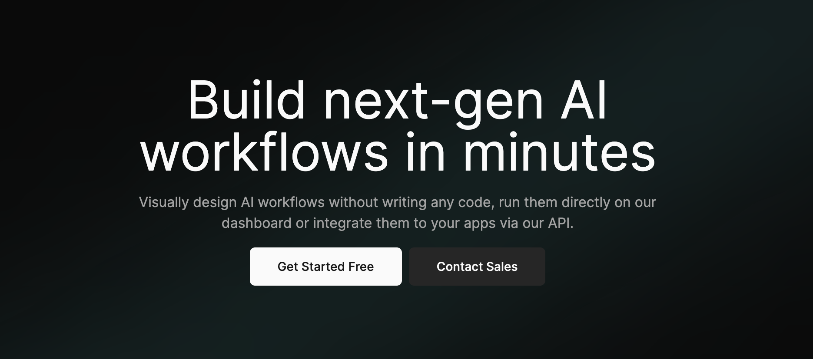

<div align="left">

[](https://www.tryleap.ai/)

# [Leap Workflows](https://www.tryleap.ai/)<a id="leap-workflows"></a>

The Leap Workflows API allows developers to run workflows, fetch workflow runs, and provide other utility functions related to workflow runs. Please use the X-Api-Key for authenticated requests.

[](https://cocoapods.org/pods/Leap)
[](https://tryleap.ai/)

</div>

## Table of Contents<a id="table-of-contents"></a>

<!-- toc -->

- [Installation](#installation)
  * [Swift Package Manager](#swift-package-manager)
  * [Carthage](#carthage)
  * [CocoaPods](#cocoapods)
- [Getting Started](#getting-started)
- [Reference](#reference)
  * [`leap.bulkWorkflowRuns.getBulk`](#leapbulkworkflowrunsgetbulk)
  * [`leap.bulkWorkflowRuns.runBulk`](#leapbulkworkflowrunsrunbulk)
  * [`leap.workflowRuns.getWorkflowRun`](#leapworkflowrunsgetworkflowrun)
  * [`leap.workflowRuns.workflow`](#leapworkflowrunsworkflow)

<!-- tocstop -->

## Installation<a id="installation"></a>


### Swift Package Manager<a id="swift-package-manager"></a>

1. In Xcode, select *File > Add Packages…* and enter `https://github.com/leap-ai/leap-workflows-swift-sdk` as the repository URL.
1. Select the latest version number from our [tags page](https://github.com/leap-ai/leap-workflows-swift-sdk/tags).
1. Add the *Leap* product to the [target of your app](https://developer.apple.com/documentation/swift_packages/adding_package_dependencies_to_your_app).

### Carthage<a id="carthage"></a>

1. Add this line to your `Cartfile`:
```shell
github "leap-ai/leap-workflows-swift-sdk"
```
2. Follow the [Carthage installation instructions](https://github.com/Carthage/Carthage#if-youre-building-for-ios-tvos-or-watchos).
3. In the future, to update to the latest version of the SDK, run the following command: `carthage update leap-workflows-swift-sdk`

### CocoaPods<a id="cocoapods"></a>

1. Add `source 'https://github.com/CocoaPods/Specs.git'` to your `Podfile`
2. Add `pod 'Leap', '~> 0.1.0'` to your `Podfile`

Your `Podfile` should look like:
```ruby
# Podfile
source 'https://github.com/CocoaPods/Specs.git'

target 'Example' do
  pod 'Leap', '~> 0.1.0'
end
```
3. Run `pod install`

```shell
❯ pod install
Analyzing dependencies
Downloading dependencies
Installing Leap 0.1.0
Generating Pods project
Integrating client project
Pod installation complete! There is 1 dependency from the Podfile and 2 total pods installed.
```

4. In the future, to update to the latest version of the SDK, run: `pod update Leap`

## Getting Started<a id="getting-started"></a>

```swift
import Leap

let leap = LeapClient(
    apiKey: "X_API_KEY"
    // Defining the base path is optional and defaults to https://api.workflows.tryleap.ai
    // basePath: "https://api.workflows.tryleap.ai"
)

let bulkRunId = "bulkRunId_example"
let getBulkResponse = try await leap.bulkWorkflowRuns.getBulk(
    bulkRunId: bulkRunId
)
```

## Reference<a id="reference"></a>


### `leap.bulkWorkflowRuns.getBulk`<a id="leapbulkworkflowrunsgetbulk"></a>

This endpoint retrieves the details of a specific bulk workflow run using its `bulk_run_id`.

#### 🛠️ Usage<a id="🛠️-usage"></a>

```swift
let bulkRunId = "bulkRunId_example"
let getBulkResponse = try await leap.bulkWorkflowRuns.getBulk(
    bulkRunId: bulkRunId
)
```

#### ⚙️ Parameters<a id="⚙️-parameters"></a>

##### bulkRunId: `String`<a id="bulkrunid-string"></a>

The ID of the bulk run to retrieve.


#### 🔄 Return<a id="🔄-return"></a>

[BulkRunSchema](./Leap/Models/BulkRunSchema.swift)

#### 🌐 Endpoint<a id="🌐-endpoint"></a>

`/v1/runs/bulk/{bulk_run_id}` `GET`

[🔙 **Back to Table of Contents**](#table-of-contents)

---


### `leap.bulkWorkflowRuns.runBulk`<a id="leapbulkworkflowrunsrunbulk"></a>

This endpoint lets the user run a specified workflow with the provided csv in bulk.

#### 🛠️ Usage<a id="🛠️-usage"></a>

```swift
let workflowId = "workflowId_example"
let inputCsvUrl = "inputCsvUrl_example"
let webhookUrl = "webhookUrl_example"
let runBulkResponse = try await leap.bulkWorkflowRuns.runBulk(
    workflowId: workflowId,
    inputCsvUrl: inputCsvUrl,
    webhookUrl: webhookUrl
)
```

#### ⚙️ Parameters<a id="⚙️-parameters"></a>

##### workflow_id: `String`<a id="workflow_id-string"></a>

The ID of the workflow to be run in bulk.


##### input_csv_url: `String`<a id="input_csv_url-string"></a>

A CSV file containing the input data for the bulk run. Each row should contain the input data for a single run.


##### webhook_url: `String`<a id="webhook_url-string"></a>

The URL to which the bulk run results should be sent to on completion.


#### 🔄 Return<a id="🔄-return"></a>

[BulkRunSchema](./Leap/Models/BulkRunSchema.swift)

#### 🌐 Endpoint<a id="🌐-endpoint"></a>

`/v1/runs/bulk` `POST`

[🔙 **Back to Table of Contents**](#table-of-contents)

---


### `leap.workflowRuns.getWorkflowRun`<a id="leapworkflowrunsgetworkflowrun"></a>

This endpoint retrieves the details of a specific workflow run using its `workflow_run_id`.

#### 🛠️ Usage<a id="🛠️-usage"></a>

```swift
let workflowRunId = "workflowRunId_example"
let getWorkflowRunResponse = try await leap.workflowRuns.getWorkflowRun(
    workflowRunId: workflowRunId
)
```

#### ⚙️ Parameters<a id="⚙️-parameters"></a>

##### workflowRunId: `String`<a id="workflowrunid-string"></a>

The ID of the workflow run to retrieve.


#### 🔄 Return<a id="🔄-return"></a>

[WorkflowRunSchema](./Leap/Models/WorkflowRunSchema.swift)

#### 🌐 Endpoint<a id="🌐-endpoint"></a>

`/v1/runs/{workflow_run_id}` `GET`

[🔙 **Back to Table of Contents**](#table-of-contents)

---


### `leap.workflowRuns.workflow`<a id="leapworkflowrunsworkflow"></a>

This endpoint lets the user run a specified workflow with the provided workflow definition.

#### 🛠️ Usage<a id="🛠️-usage"></a>

```swift
let workflowId = "workflowId_example"
let webhookUrl = "webhookUrl_example"
let input = "TODO"
let workflowResponse = try await leap.workflowRuns.workflow(
    workflowId: workflowId,
    webhookUrl: webhookUrl,
    input: input
)
```

#### ⚙️ Parameters<a id="⚙️-parameters"></a>

##### workflow_id: `String`<a id="workflow_id-string"></a>

The ID of the workflow to be run.


##### webhook_url: `String`<a id="webhook_url-string"></a>

The URL to which the workflow results should be sent to on completion.


##### input: `[String: AnyCodable]`<a id="input-string-anycodable"></a>

Variables that the workflow can use globally and their values.


#### 🔄 Return<a id="🔄-return"></a>

[WorkflowRunSchema](./Leap/Models/WorkflowRunSchema.swift)

#### 🌐 Endpoint<a id="🌐-endpoint"></a>

`/v1/runs` `POST`

[🔙 **Back to Table of Contents**](#table-of-contents)

---


## Author<a id="author"></a>
This TypeScript package is automatically generated by [Konfig](https://konfigthis.com)
